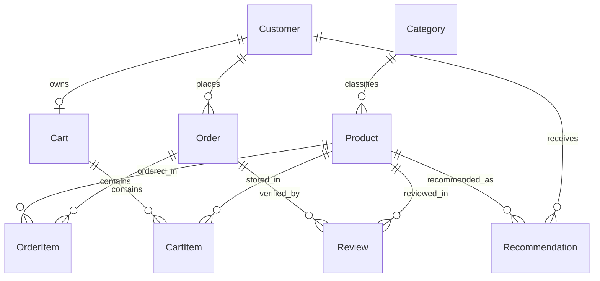
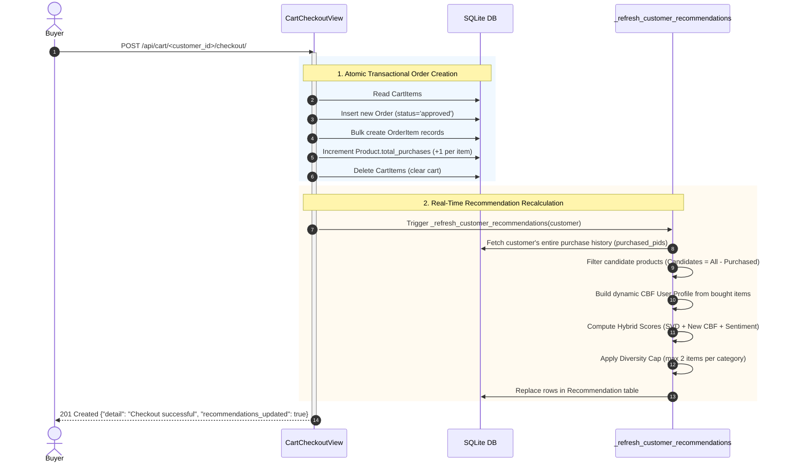

# E-Commerce Recommendation Backend: Complete Architecture & Process Guide

> **Target Audience:** Developers, Data Scientists, Frontend Engineers, System Architects  
> **Core Technologies:** Python 3.13, Django 6.1, Django REST Framework, scikit-surprise (SVD), Hugging Face Transformers (DistilBERT), SciPy / NumPy  
> **Status:** Production-Ready & Verified

---

## Table of Contents
1. [Executive Overview & Design Philosophy](#1-executive-overview--design-philosophy)
2. [Database Schema & Data Architecture](#2-database-schema--data-architecture)
3. [The Machine Learning & Hybrid Recommendation Engine](#3-the-machine-learning--hybrid-recommendation-engine)
   - [3.3 Why a Hybrid? How Each Model Affects the Result](#33-why-a-hybrid-how-each-model-affects-the-result)
4. [Offline vs. Online Processing Architecture](#4-offline-vs-online-processing-architecture)
5. [End-to-End Runtime Processes (How It Works)](#5-end-to-end-runtime-processes-how-it-works)
   - [Process 1: Catalog Browsing & Filtered Search](#process-1-catalog-browsing--filtered-search)
   - [Process 2: Cart State Management](#process-2-cart-state-management)
   - [Process 3: Checkout & Real-Time Recommendation Recalculation](#process-3-checkout--real-time-recommendation-recalculation)
   - [Process 4: Recommendation Serving (Sub-10ms)](#process-4-recommendation-serving-sub-10ms)
   - [Process 5: Order History & Review Tracking](#process-5-order-history--review-tracking)
6. [Data Pipelines & Management Commands](#6-data-pipelines--management-commands)
7. [Complete REST API Reference](#7-complete-rest-api-reference)
8. [Configuration & Hyperparameter Tuning](#8-configuration--hyperparameter-tuning)
9. [Project Directory Layout](#9-project-directory-layout)

---

## 1. Executive Overview & Design Philosophy

The backend powers an intelligent e-commerce store built on the **Brazilian Olist E-Commerce dataset**. It solves two conflicting requirements in modern e-commerce systems:
1. **High Model Complexity:** Recommendations must blend Collaborative Filtering (user behavior patterns), Content-Based Filtering (product text & specifications), and NLP Review Sentiment (buyer satisfaction).
2. **Sub-20ms Request Latency:** User-facing shopping pages, carts, and recommendation shelves must load almost instantly without freezing under high concurrency.

### The Core Architectural Rule: "Zero ML Inference in the Request Path"

Running neural networks (DistilBERT) or full matrix factorizations (SVD) inside a live HTTP `GET` request causes API timeouts, CPU spikes, and severe lag. To prevent this, the system operates on **Decoupled Asynchronous Intelligence**:

- **Model Training & Heavy Inference**: Executed offline or in background batch workers. Heavy artifacts (SVD matrices, TF-IDF representations, sentiment scores) are precalculated and stored in binary arrays or database fields.
- **Online Transactional API**: When a customer requests catalog items or recommendations, Django performs **indexed database reads (`<10ms`)**.
- **Real-Time Recalculation on Critical Events**: When a customer finishes checkout, a lightweight, fast scoring function instantly updates their personal recommendations using the precomputed vectors—keeping suggestions fresh without retraining models from scratch.

---

## 2. Database Schema & Data Architecture

The data layer is defined in [`store/models.py`](file:///d:/01_Projects_Workspace/Recoomedation%20System%20Copstoe%20Project/store/models.py). It consists of 9 core models divided into transactional and analytical entities.

### Entity-Relationship Diagram



### Detailed Model Descriptions

| Model | Table / Purpose | Key Fields | Performance / Design Notes |
|---|---|---|---|
| **`Category`** | Product classification hierarchy | `name` (PT original), `name_translated` (EN) | Indexed on `name`. Preloaded in catalog views. |
| **`Customer`** | Buyer personas from Olist | `external_id` (MD5 hex), `city`, `state` | `external_id` is unique and indexed for fast lookups. |
| **`Product`** | E-commerce items | `external_id`, `name`, `name_translated`, `price`, `avg_sentiment_score`, `total_purchases`, `image_url` | **Denormalized fields** (`avg_sentiment_score`, `total_purchases`) allow high-speed filtering without runtime aggregation joins. |
| **`Order`** | Completed purchases | `external_id`, `customer`, `purchased_at`, `status` | Status choices: `approved`, `delivered`, `shipped`, `processing`, etc. |
| **`OrderItem`** | Historical lines within an order | `order`, `product`, `price` | Captures historical snapshot price at time of purchase. |
| **`Review`** | Customer feedback & NLP labels | `external_id`, `product`, `comment_text`, `comment_text_translated`, `rating`, `sentiment`, `sentiment_processed_at` | Indexed on `sentiment`. Stores binary NLP sentiment (`positive`/`negative`). |
| **`Cart`** | Customer's active shopping cart | `customer`, `created_at`, `updated_at` | Enforced 1-to-1 relationship with `Customer`. |
| **`CartItem`** | Line items inside an active cart | `cart`, `product`, `quantity` | `unique_together = [('cart', 'product')]` prevents duplicate cart rows. |
| **`Recommendation`** | Precomputed top-N recommendations | `customer`, `product`, `score`, `generated_at` | Compound database index on `('customer', '-score')` for instant top-N queries. |

---

## 3. The Machine Learning & Hybrid Recommendation Engine

The recommendation system implements a **True Hybrid (v3)** architecture combining three independent signals:

```
                          ┌────────────────────────────────┐
                          │   Collaborative Filtering      │
                          │   (SVD Latent Factor Vectors)  │
                          └───────────────┬────────────────┘
                                          │  weight: λ_svd (0.6)
                                          ▼
┌──────────────────────┐      ┌─────────────────────────┐      ┌──────────────────────┐
│ Content-Based (CBF)  │─────►│  True Hybrid Combiner   │◄─────│ NLP Review Sentiment │
│ (TF-IDF + 5D Specs)  │      │  Hybrid Scoring Engine  │      │ (DistilBERT Model)   │
└──────────────────────┘      └───────────┬─────────────┘      └──────────────────────┘
   weight: λ_cbf (0.4)                    │                      weight: γ (0.3)
                                          ▼
                              ┌─────────────────────────┐
                              │  Diversity Filter       │
                              │  (Max 2 per category)   │
                              └───────────┬─────────────┘
                                          ▼
                              ┌─────────────────────────┐
                              │ Recommendation DB Table │
                              └─────────────────────────┘
```

### 3.1 Mathematical Scoring Formula

For any customer $u$ and candidate product $i$, the hybrid relevance score is computed as:

$$\text{Score}(u, i) = \lambda_{svd} \cdot S_{CF}(u, i) + \lambda_{cbf} \cdot S_{CBF}(u, i) + \gamma \cdot (\text{Sentiment}_i - 0.5)$$

Where:
- $\lambda_{svd} = 0.6$: Weight for Collaborative Filtering.
- $\lambda_{cbf} = 0.4$: Weight for Content-Based Filtering.
- $\gamma = 0.3$: Weight for NLP review sentiment.

#### A. Collaborative Filtering Component ($S_{CF}$)
Trained on user-item interaction matrices using SVD matrix factorization:
$$S_{CF}(u, i) = \text{BASE} + (q_i^T \cdot p_u) + \alpha \cdot b_i$$
- $p_u \in \mathbb{R}^{50}$: Latent preference vector of customer $u$.
- $q_i \in \mathbb{R}^{50}$: Latent factor vector of product $i$.
- $b_i$: Learned product popularity bias.
- $\alpha = 0.5$: Product bias damping factor (balances personal taste vs. general popularity).
- $\text{BASE} = 3.0$: Additive baseline to keep ratings on a standard 1–5 scale.

#### B. Content-Based Filtering Component ($S_{CBF}$)
Constructed from TF-IDF category keywords and 5 physical/price features:
$$S_{CBF}(u, i) = \omega \cdot \cos(\vec{t}_i, \bar{t}_u) + (1 - \omega) \cdot \frac{1}{1 + \|\vec{n}_i - \bar{n}_u\| / \sqrt{5}}$$
- $\vec{t}_i$: 193-word TF-IDF token vector for product $i$'s category.
- $\vec{n}_i$: 5-dimensional normalized vector: `[price, weight_g, length_cm, height_cm, width_cm]`.
- $\bar{t}_u, \bar{n}_u$: Mean vectors of all products previously purchased by user $u$.
- $\omega = 0.7$: 70% weight on text similarity, 30% weight on physical/pricing similarity.

#### C. NLP Sentiment Component ($\text{Sentiment}_i$)
A fine-tuned **DistilBERT** binary text classifier processes customer reviews:
$$\text{Sentiment}_i = \text{Mean}(\{ \text{Score}_k \mid \text{Review } k \text{ of product } i \}) \in [0.0, 1.0]$$
The term $(\text{Sentiment}_i - 0.5)$ centers neutral reviews at 0, rewarding positive products and penalizing poorly-rated items.

### 3.2 Business Rules & Guardrails

1. **Purchase Exclusion (Negative Filtering):** A customer is **never** recommended items they have already ordered. The candidate pool is strictly:
   $$\text{Candidates} = \text{All Products} \setminus \text{Purchased Products}(u)$$
2. **Diversity Capping:** A two-pass greedy selector limits suggestions to **at most 2 products per category** (`MAX_PER_CAT = 2`), ensuring catalog breadth rather than clustering in a single category.
3. **Cold-Start Fallback:**
   - If a customer has no prior purchases or SVD factor, $p_u = \mathbf{0}$, and the system relies on product popularity bias + sentiment.
   - As soon as the customer makes their first purchase, their CBF vector is dynamically computed.

### 3.3 Why a Hybrid? How Each Model Affects the Result

#### What each model contributes

| Model | Question it answers | Strength | Weakness (covered by…) |
|---|---|---|---|
| **SVD (CF)** | "What do customers *like you* buy?" | Finds non-obvious, cross-category patterns from behaviour | Needs history; new users get $p_u = 0$, new products fall back to popularity → **CBF** |
| **TF-IDF + specs (CBF)** | "What is *similar* to what you bought?" | Works from the first purchase; updates instantly at checkout | Over-specialises (only one category) → **SVD + diversity cap** |
| **DistilBERT sentiment** | "Were other buyers *happy* with it?" | Quality signal: purchases ≠ satisfaction | Not personal (same for everyone) → kept as a small adjustment |

#### Why we chose this approach

1. **Extreme sparsity of Olist** — the vast majority of Olist customers (≈97%) bought only once, so pure CF has almost no signal for most users. CBF fills that gap.
2. **Cold start** — new customers and new products still get meaningful results via CBF and the popularity fallback.
3. **Relevance ≠ quality** — SVD and CBF estimate *will they like it*; sentiment checks *is it actually good*, so a popular product with many complaints is pushed down.
4. **Discovery vs. safety** — SVD brings surprising cross-category items, CBF brings safe similar items, the diversity cap keeps the list varied.
5. **Fast to update** — CBF profile and sentiment are cheap to recompute, which makes the real-time checkout refresh possible without retraining SVD.

#### Measured influence (real output)

Generated with the read-only script [`scratch/explain_hybrid_scores.py`](file:///d:/01_Projects_Workspace/Recoomedation%20System%20Copstoe%20Project/scratch/explain_hybrid_scores.py) for the demo customer `1dfbdc636de09adbcdbc3d34e15084f3` (computers buyer). Columns `SVD`, `CBF`, `Sent` are the **weighted** contributions; they add up to `TOTAL`.

| # | Product | Category | qi·pu | bi | SVD | CBF | Sent | **TOTAL** |
|---|---|---|---|---|---|---|---|---|
| 1 | Dell UltraSharp 27" 4K Monitor | Computers Accessories | 0.144 | 0.065 | 1.906 | **0.370** | +0.129 | **2.405** |
| 2 | Logitech MX Master 3S Mouse | Computers Accessories | 0.164 | 0.052 | 1.914 | **0.348** | +0.111 | **2.373** |
| 3 | BAGSMART Packing Cubes | Luggage Accessories | 0.095 | 0.322 | 1.953 | 0.144 | +0.150 | **2.247** |
| 4 | Samsonite Omni 2 Luggage | Luggage Accessories | 0.113 | 0.282 | 1.953 | 0.143 | +0.132 | **2.227** |
| 5 | Ippodo Matcha Powder | Drinks | 0.053 | 0.407 | 1.954 | 0.068 | +0.126 | **2.147** |
| 6 | West Elm Velvet Armchair | Furniture Decor | 0.201 | 0.034 | 1.931 | 0.054 | +0.150 | **2.135** |

**Spread of each component across the top-10** (max − min, i.e. how much it actually changes the order) for the demo customers:

| Customer | SVD spread | CBF spread | Sentiment spread |
|---|---|---|---|
| `1dfbdc63…` (computers) | 0.090 | **0.318** | 0.039 |
| `2e43e031…` (sports) | 0.237 | **0.287** | 0.060 |
| `33de26d1…` (home decor) | 0.257 | **0.299** | 0.060 |
| `fe86d940…` (auto) | 0.130 | **0.283** | 0.081 |

> [!NOTE]
> The SVD column looks largest (~1.9) but **1.80 of it is the constant `0.6 × BASE`**, identical for every product, so it does not affect the ranking. Only the varying part (`qi·pu + 0.5·bi`) matters.

#### What the numbers show — a division of labour

- **CBF decides positions 1–2.** Products in the customer's own category get CBF ≈ 0.31–0.37 vs ≈ 0.05 for others, a gap larger than any SVD difference.
- **SVD decides positions 3–10.** Once the diversity cap blocks a 3rd same-category item, CBF is nearly flat (≈0.04–0.08) and SVD (`bi` + `qi·pu`) picks the cross-category discoveries (luggage, matcha, furniture).
- **Sentiment is a tie-breaker.** It moves scores by at most ~0.08 within the top-10, enough to swap neighbours with close scores but never to override taste.
- **The hybrid rescues items a single model would miss.** Example: for the sports customer, *Bowflex Dumbbells* has a **negative** SVD taste match (`qi·pu = −0.217`) but CBF = 0.357 lifts it to **#2**. For the home-decor customer, *Arhaus Brass Mirror* (`qi·pu = −0.105`) reaches **#3** the same way.

> [!IMPORTANT]
> **Honest limitations (good to mention in Q&A):**
> - Weights `0.6 / 0.4 / 0.3` were **set manually**, not tuned on validation data. Next step: grid-search them with Precision@K / Recall@K on held-out purchases.
> - The components are on **different scales** (SVD ≈ 2–4, CBF 0–1), so the weights are not direct "percent influence". That is why CBF, despite its lower weight, has the largest spread. Min-max normalising each component before blending would make weights interpretable.
> - Products with **no reviews** get a 0 sentiment adjustment, so they can outrank products with slightly negative reviews.

Re-run the breakdown at any time:

```powershell
uv run python scratch/explain_hybrid_scores.py                 # default demo customer
uv run python scratch/explain_hybrid_scores.py <customer_id>   # specific customer
uv run python scratch/explain_hybrid_scores.py --all           # every customer with orders
```

---

## 4. Offline vs. Online Processing Architecture

```
┌────────────────────────────────────────────────────────────────────────────────────────┐
│                                 OFFLINE BATCH JOBS                                     │
│                                                                                        │
│  [Raw Olist CSVs] ──► Colab SVD Training ──► models/svd_cf.pkl                         │
│  [Product Meta]   ──► TF-IDF & Features  ──► models/processed/cbf_precomputed.npz      │
│  [Reviews Text]   ──► DistilBERT Classifier ──► Product.avg_sentiment_score           │
│  [All Customers]  ──► compute_recommendations ──► Prepopulated Recommendation Table    │
└──────────────────────────────────────────┬─────────────────────────────────────────────┘
                                           │
                                           ▼ (Stored in DB & Pickles)
┌────────────────────────────────────────────────────────────────────────────────────────┐
│                              ONLINE HIGH-SPEED API (/api/)                             │
│                                                                                        │
│  Client Request ──► Django URLs ──► Django Views ──► DB Read / Cache ──► Sub-10ms JSON │
│                                                                                        │
│  * Exception: Checkout triggers an isolated, real-time recalculation of only that      │
│               specific customer's top recommendations.                                 │
└────────────────────────────────────────────────────────────────────────────────────────┘
```

---

## 5. End-to-End Runtime Processes (How It Works)

### Process 1: Catalog Browsing & Filtered Search
- **Client Action:** User opens catalog or searches for an item.
- **API Call:** `GET /api/products/?category=7&search=mouse&ordering=-avg_sentiment_score`
- **Internal Execution:**
  1. [`ProductListView`](file:///d:/01_Projects_Workspace/Recoomedation%20System%20Copstoe%20Project/store/views.py#L449) receives request parameters.
  2. Django ORM performs indexed SQL query with `select_related('category')`.
  3. Precalculated fields (`price`, `total_purchases`, `avg_sentiment_score`) are filtered and sorted directly in SQL.
  4. [`ProductSummarySerializer`](file:///d:/01_Projects_Workspace/Recoomedation%20System%20Copstoe%20Project/store/serializers.py#L88) generates English titles, image URLs, and category badges.
- **Latency:** ~5–12ms.

---

### Process 2: Cart State Management
- **Client Action:** User adds, modifies, or deletes cart items.
- **API Calls:**
  - `GET /api/cart/<customer_external_id>/`
  - `POST /api/cart/<customer_external_id>/add/` with payload `{"product_id": 42, "quantity": 1}`
  - `PATCH /api/cart/<customer_external_id>/update/<item_id>/` with payload `{"quantity": 3}`
  - `DELETE /api/cart/<customer_external_id>/remove/<item_id>/`
- **Internal Execution:**
  1. Handled by [`CartView`](file:///d:/01_Projects_Workspace/Recoomedation%20System%20Copstoe%20Project/store/views.py#L71), [`CartAddItemView`](file:///d:/01_Projects_Workspace/Recoomedation%20System%20Copstoe%20Project/store/views.py#L106), etc.
  2. Ensures the cart exists via `_get_or_create_cart(customer)`.
  3. Modifies `CartItem` rows with validation (`quantity >= 1`).
  4. Returns the updated cart with computed total price.

---

### Process 3: Checkout & Real-Time Recommendation Recalculation

This is the primary state transition in the system where transactional updates and recommendation intelligence intersect.



#### Detailed Breakdown of Checkout Steps:
1. **Validation:** Checks if the cart contains at least one item; returns `400 Bad Request` if empty.
2. **Atomic DB Transaction (`transaction.atomic()`):**
   - Creates an `Order` record with a unique hex ID and status `"approved"`.
   - Creates `OrderItem` records capturing snapshot prices.
   - Atomically increments `Product.total_purchases` on each purchased product.
   - Clears the customer's `CartItem` records.
3. **Recommendation Refresh ([`_refresh_customer_recommendations`](file:///d:/01_Projects_Workspace/Recoomedation%20System%20Copstoe%20Project/store/views.py#L193)):**
   - Retrieves all product IDs ever purchased by this customer across all historical orders.
   - Excludes these purchased items from the candidate pool so the customer is not recommended products they already own.
   - Uses the purchased items' feature vectors to update the user's CBF profile.
   - Computes hybrid scores across all remaining candidate products.
   - Applies the diversity filter (`MAX_PER_CAT = 2`).
   - Deletes old recommendations for that customer and bulk-inserts the newly calculated top recommendations.
4. **Response:** Returns `201 Created` with order ID and confirmation that recommendations have been updated.

---

### Process 4: Recommendation Serving (Sub-10ms)
- **Client Action:** User opens their personal recommendations page or views recommended items on the home screen.
- **API Call:** `GET /api/recommendations/<customer_external_id>/?n=10`
- **Internal Execution ([`RecommendationListView`](file:///d:/01_Projects_Workspace/Recoomedation%20System%20Copstoe%20Project/store/views.py#L339)):**
  1. Validates `customer_external_id`.
  2. Queries the `Recommendation` table directly:
     ```python
     recommendations = (
         Recommendation.objects.filter(customer=customer)
         .select_related("product__category")
         .order_by("-score")[:n]
     )
     ```
  3. No ML computation occurs during this request.
  4. Returns the top-N serialized products with their precomputed hybrid scores.
- **Latency:** ~3–8ms.

---

### Process 5: Order History & Review Tracking
- **Order History:** `GET /api/orders/<customer_external_id>/`
  - Fetches past orders sorted by `-purchased_at`, embedding order items and product metadata.
- **Reviews:** `GET /api/reviews/?product=<product_external_id>`
  - Fetches customer reviews for a given product, including rating, translated text, and sentiment labels (`positive` / `negative`).

---

## 6. Data Pipelines & Management Commands

All heavy data preparation, translation, classification, and seeding are managed through Django management commands in [`store/management/commands/`](file:///d:/01_Projects_Workspace/Recoomedation%20System%20Copstoe%20Project/store/management/commands/):

| Command | Purpose | Input / Artifacts Used | Output in Database / Files |
|---|---|---|---|
| **`seed_olist_catalog`** | **Master Bootstrap Command** | Curated Olist data, SVD model, CBF matrix | Populates 100 products, 30 categories, 5 SVD personas, 1,185 reviews, and precalculates recommendations |
| **`import_data`** | Raw Olist CSV Ingestion | Raw CSV files in `data/` | Seeds raw `Category`, `Customer`, `Product`, `Order`, `OrderItem` tables |
| **`import_reviews`** | Review Text Ingestion | `olist_order_reviews_dataset.csv` | Seeds raw review text and star ratings |
| **`translate_products`** | Machine Translation | `facebook/nllb-200-distilled-600M` | Populates `name_translated` on categories and products |
| **`run_sentiment_batch`** | Batch Review Sentiment Scoring | Fine-tuned DistilBERT model | Fills `Review.sentiment` and updates `Product.avg_sentiment_score` |
| **`compute_recommendations`** | Global Offline RecSys Batch | `svd_cf.pkl`, `cbf_precomputed.npz` | Recomputes recommendation rows for all or specific customers |
| **`diagnose_recommendations`** | RecSys Debugger / Inspector | Models and DB | Prints SVD latent vectors, CBF scores, and component breakdowns for any customer |

---

## 7. Complete REST API Reference

Base URL: `http://127.0.0.1:8000/api/`

| Endpoint | Method | URL / Query Params | Request Body | Response (Success) | Purpose |
|---|---|---|---|---|---|
| **API Root** | `GET` | `/api/` | None | `200 OK` (Hyperlinks map) | Discover all available API endpoints |
| **Categories List** | `GET` | `/api/categories/` (`?search=`, `?ordering=`) | None | `200 OK` (Array of categories) | List categories with English names & product counts |
| **Category Detail** | `GET` | `/api/categories/<id>/` | None | `200 OK` (Category object) | Detailed category info |
| **Products List** | `GET` | `/api/products/` (`?category=`, `?search=`, `?sentiment=`, `?ordering=`, `?page=`) | None | `200 OK` (Paginated product list) | Browse catalog, search, and filter |
| **Product Detail** | `GET` | `/api/products/<id_or_hash>/` | None | `200 OK` (Full product object) | Product page with specs and sentiment |
| **Get Cart** | `GET` | `/api/cart/<customer_id>/` | None | `200 OK` (Cart + items + total) | View customer's current cart |
| **Add to Cart** | `POST` | `/api/cart/<customer_id>/add/` | `{"product_id": int, "quantity": int}` | `200 OK` (Updated cart) | Add item or increment quantity |
| **Update Cart Item** | `PATCH` | `/api/cart/<customer_id>/update/<item_id>/` | `{"quantity": int}` | `200 OK` (Updated cart) | Adjust item quantity |
| **Remove Cart Item** | `DELETE`| `/api/cart/<customer_id>/remove/<item_id>/` | None | `200 OK` (Updated cart) | Remove item from cart |
| **Checkout** | `POST` | `/api/cart/<customer_id>/checkout/` | None | `201 Created` (`Order` receipt) | Convert cart to order & recalculate recommendations |
| **Orders** | `GET` | `/api/orders/<customer_id>/` | None | `200 OK` (Array of past orders) | View customer order history |
| **Reviews** | `GET` | `/api/reviews/?product=<product_external_id>` | None | `200 OK` (Array of reviews) | View product reviews with sentiment labels |
| **Recommendations**| `GET` | `/api/recommendations/<customer_id>/?n=10` | None | `200 OK` (Ranked products) | Fetch personalized recommendations |
| **Stats** | `GET` | `/api/stats/` | None | `200 OK` (Platform metrics) | System counts (products, orders, reviews, etc.) |

---

## 8. Configuration & Hyperparameter Tuning

All parameters controlling the recommendation algorithm are defined in [`recsys_backend/settings.py`](file:///d:/01_Projects_Workspace/Recoomedation%20System%20Copstoe%20Project/recsys_backend/settings.py):

```python
# recsys_backend/settings.py

RECSYS_SVD_WEIGHT = 0.6    # Weight of Collaborative Filtering (λ_svd)
RECSYS_CBF_WEIGHT = 0.4    # Weight of Content-Based Filtering (λ_cbf)
RECSYS_ALPHA      = 0.5    # Product bias damping factor (α)
RECSYS_BASE       = 3.0    # Additive rating baseline
RECSYS_GAMMA      = 0.3    # Sentiment score weight (γ)
RECSYS_MAX_PER_CAT = 2     # Maximum items allowed from a single category
CBF_TEXT_WEIGHT   = 0.7    # TF-IDF vs. numerical specs weight in CBF (ω)
```

### Tuning Guide:
- **To emphasize personal taste over popularity:** Reduce `RECSYS_ALPHA` from `0.5` to `0.2` (lowers the influence of universally popular products).
- **To make recommendations strictly content-driven:** Increase `RECSYS_CBF_WEIGHT` to `0.7` and reduce `RECSYS_SVD_WEIGHT` to `0.3`.
- **To give higher weight to customer review sentiment:** Increase `RECSYS_GAMMA` from `0.3` to `0.6`.
- **To allow more products from the same category:** Increase `RECSYS_MAX_PER_CAT` to `3` or `4`.

---

## 9. Project Directory Layout

```
Recoomedation System Copstoe Project/
├── recsys_backend/                  # Django project root
│   ├── settings.py                  # Database, DRF, ML paths, RECSYS_* parameters
│   ├── urls.py                      # Master routing (/admin/, /api/)
│   └── wsgi.py / asgi.py
│
├── store/                           # Store application
│   ├── models.py                    # 9 Database Models
│   ├── views.py                     # 13 REST API Views & Checkout recalculation
│   ├── serializers.py               # Serializers with title generation & badges
│   ├── urls.py                      # /api/* route mapping
│   ├── apps.py                      # App initialization & model pre-warming
│   ├── ml/
│   │   ├── __init__.py
│   │   └── loader.py                # Thread-safe lazy singleton loaders for SVD & DistilBERT
│   ├── tests/
│   │   └── test_recommendations.py  # Automated test suite (Cold start, diversity, checkout)
│   └── management/commands/
│       ├── seed_olist_catalog.py    # Bootstrap 100 products, 30 categories, 5 SVD personas
│       ├── compute_recommendations.py # Core hybrid scoring & diversity algorithm
│       ├── run_sentiment_batch.py   # DistilBERT sentiment batch processor
│       ├── translate_products.py    # NLLB-200 translation pipeline
│       ├── diagnose_recommendations.py # Latent vector and score breakdown inspector
│       └── import_data.py           # Olist CSV dataset ingestion
│
├── models/                          # Serialized ML artifacts
│   ├── svd_cf.pkl                   # Trained SVD model (scikit-surprise)
│   ├── sentiment_model/             # Fine-tuned DistilBERT weights & tokenizer
│   └── processed/
│       ├── cbf_precomputed.npz      # Precomputed TF-IDF & numerical product vectors
│       ├── tfidf_matrix.npz
│       └── products_features.parquet
│
├── Frontend/                        # Frontend UI (Vanilla ES6 modules + CSS design system)
│   ├── index.html                   # Home & showcase
│   ├── catalog.html                 # Product catalog & filters
│   ├── cart.html                    # Cart & checkout
│   ├── recommendations.html         # Personalized recommendation shelf
│   ├── orders.html                  # Order history
│   ├── nlp-lab.html                 # Live sentiment analysis playground
│   └── js/                          # Client API connectors & state management
│
├── BACKEND_ARCHITECTURE_AND_PROCESS.md # This comprehensive guide
├── TEAM_BACKEND_GUIDE.md            # Team guide with test persona breakdown
└── SETUP.md                         # Quickstart setup instructions
```
