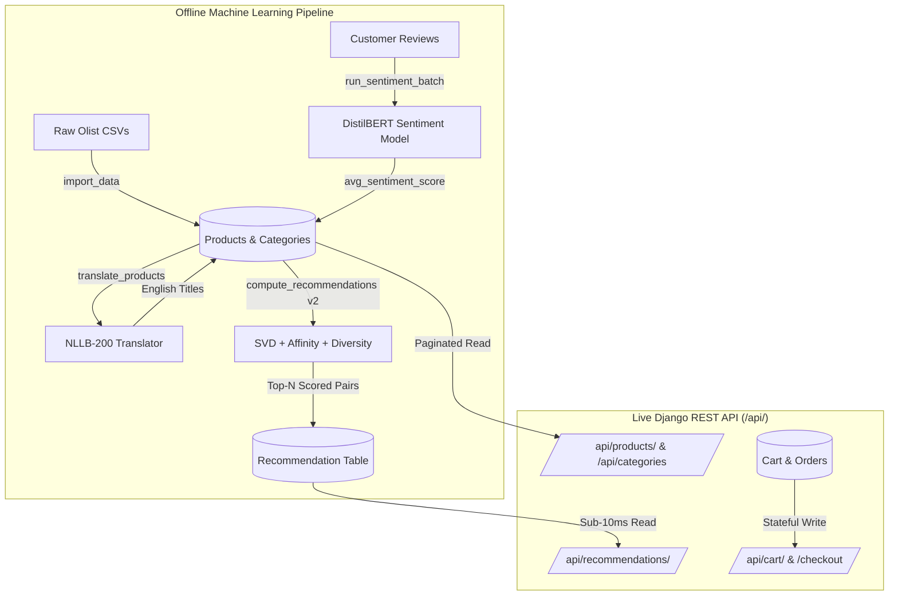

# Team Guide: E-Commerce Recommendation Backend & Architecture

> **Audience:** Development Team, Frontend Engineers, Data Science / ML Collaborators  
> **Stack:** Python 3.13, Django 6.1, Django REST Framework, scikit-surprise (SVD), Hugging Face Transformers  
> **Status:** Production-Ready & Verified  
> **Last Updated:** 2026-09-30 — Recommendation engine upgraded to v2 (diversity-aware hybrid)

---

## 📌 1. Executive Summary & Core Design Philosophy

This backend powers an intelligent e-commerce store built on the Brazilian Olist dataset. It provides catalog browsing, customer carts, order checkouts, and **personalized hybrid recommendations** combining Collaborative Filtering, category affinity, and sentiment signals.

### The Golden Rule: "Zero ML Inference in the Request Path"
In real-world e-commerce, user-facing APIs must respond in **under 20 milliseconds**.
Running heavy Transformer models or training Matrix Factorization algorithms during a live HTTP request causes timeouts and crashes servers.

**Our Architecture Solution:**
- **Offline Batch Processing**: Heavy AI/ML calculations (text translation, review sentiment analysis, and SVD recommendation scoring) run periodically via background management commands and persist their outputs in the database.
- **Online Low-Latency API**: When users view a product or open their recommendation shelf, the API performs **lightning-fast database reads (<10ms)**.

---

## 🏛️ 2. High-Level Architecture



---

## 🧠 3. How the Recommendation Engine Works (v2 Hybrid)

Our recommendation system uses **Matrix Factorization via SVD** (scikit-surprise, saved at `models/svd_cf.pkl`) as its primary signal, augmented by **category affinity** (content-based) and **review sentiment**.

### 3.1 Score Formula

For any given customer $u$ and candidate product $i$:

$$\text{score} = \underbrace{BASE + q_i^T \cdot p_u + \alpha \cdot b_i}_{\text{SVD component}} + \underbrace{\beta \cdot \text{affinity}(c_i)}_{\text{content-based}} + \underbrace{\gamma \cdot (\text{sentiment}_i - 0.5)}_{\text{sentiment}}$$

| Symbol | Meaning | Default | Setting Override |
|---|---|---|---|
| $BASE$ | Additive baseline | 3.0 | `RECSYS_BASE` |
| $q_i^T \cdot p_u$ | SVD latent dot product (personalisation) | — | — |
| $\alpha$ | Product-bias damping factor | **0.5** | `RECSYS_ALPHA` |
| $b_i$ | Product bias (popularity in training data) | — | — |
| $\beta$ | Category affinity weight | **1.0** | `RECSYS_BETA` |
| $\text{affinity}(c_i)$ | Fraction of customer's purchases in category $c_i$ | [0, 1] | — |
| $\gamma$ | Sentiment weight | **0.3** | `RECSYS_GAMMA` |
| $\text{sentiment}_i$ | `avg_sentiment_score` ∈ [0, 1] | — | — |

> **Why $\alpha = 0.5$?** The raw SVD formula gives full weight to $b_i$ (product bias), which caused the same "globally popular" products to rank #1 for every customer. Damping it to 50% lets the personalisation term $q_i^T \cdot p_u$ and the affinity boost meaningfully steer the ranking.

### 3.2 Scoring Rules

| Situation | Behaviour |
|---|---|
| User known in SVD trainset | Full formula above |
| **Cold-start** user (not in trainset) | $p_u = \mathbf{0}$, $b_u = 0$ — affinity boost carries personalisation |
| **Unknown product** (not in trainset) | Popularity fallback: $1.0 + \min(\text{purchases}/10,\ 2.0)$ — always below the SVD range so it never outranks known products |
| Product has no reviews (`total_purchases == 0`) | Sentiment term **skipped** (0.0 is not treated as negative) |

### 3.3 Category Affinity (Content-Based Boost)

Before scoring, the command precomputes each customer's **purchase distribution by category** from their `OrderItem` history:

$$\text{affinity}(c) = \frac{\text{# purchases in category } c}{\text{total purchases}}$$

This works even for cold-start users (whose seeded purchases are used directly), ensuring the top category always appears prominently in recommendations.

### 3.4 Diversity Cap

After ranking, a **two-pass greedy cap** enforces at most `MAX_PER_CAT = 2` (overridable via `RECSYS_MAX_PER_CAT`) products from any single category in the final top-N list. Slots freed by the cap are filled from the next-best ranked items whose category still has room.

### 3.5 Purchase Exclusion

Before scoring, the customer's full purchase history is fetched and **all purchased product IDs are excluded** from the candidate pool. Customers never see items they already bought.

---

## 🧪 4. The 3-Customer Live Verification Scenario

To test and verify the CF engine end-to-end, we maintain a reproducible scenario with **3 distinct customer personas**:

```powershell
uv run python manage.py seed_test_scenario
```

---

### 👤 Customer 1: Alice Silva (Home Decor & Furniture Fan)
- **Customer ID**: `c37cc6c1a59d81460a3059744f7ada1c` | São Paulo, SP
- **Category Affinity**: 100% `furniture_decor`
- **Top-5 Recommendations (v2)**:

| # | Product | Category | Score |
|---|---|---|---|
| 1 | Premium Furniture Decor #83AAE8 | `furniture_decor` | 4.1696 |
| 2 | Signature Furniture Decor #A9E189 | `furniture_decor` | 4.1654 |
| 3 | Pro Pet Shop #A4AA7C | `pet_shop` | 3.2918 |
| 4 | Urban Sports Leisure #94EDEF | `sports_leisure` | 3.2407 |
| 5 | Original Housewares #CF262D | `housewares` | 3.2257 |

- **Live Endpoint**:  
  `GET http://127.0.0.1:8000/api/recommendations/c37cc6c1a59d81460a3059744f7ada1c/?n=5`

---

### 👤 Customer 2: Bruno Santos (Sports & Outdoor Enthusiast)
- **Customer ID**: `3e2157f91502458bc58455fd798ed58a` | Rio de Janeiro, RJ
- **Category Affinity**: 100% `sports_leisure`
- **Top-5 Recommendations (v2)**:

| # | Product | Category | Score |
|---|---|---|---|
| 1 | Smart Sports Leisure #B9EE75 | `sports_leisure` | 4.1553 |
| 2 | Classic Sports Leisure #FA381A | `sports_leisure` | 4.1544 |
| 3 | Pro Pet Shop #A4AA7C | `pet_shop` | 3.2992 |
| 4 | Urban Fashion Bags Accessories #6CC58E | `fashion_bags_accessories` | 3.2475 |
| 5 | Signature Musical Instruments #818430 | `musical_instruments` | 3.2269 |

- **Live Endpoint**:  
  `GET http://127.0.0.1:8000/api/recommendations/3e2157f91502458bc58455fd798ed58a/?n=5`

---

### 👤 Customer 3: Carlos Costa (Computers & Technology Geek)
- **Customer ID**: `feb2a9889d236875c3510880bf9576f3` | Curitiba, PR
- **Category Affinity**: 100% `computers_accessories`
- **Top-5 Recommendations (v2)**:

| # | Product | Category | Score |
|---|---|---|---|
| 1 | Classic Computers Accessories #AAE961 | `computers_accessories` | 4.0924 |
| 2 | Classic Computers Accessories #0021A8 | `computers_accessories` | 4.0518 |
| 3 | Essential Furniture Decor #A237DE | `furniture_decor` | 3.3093 |
| 4 | Pro Pet Shop #A4AA7C | `pet_shop` | 3.3088 |
| 5 | Premium Garden Tools #8D404E | `garden_tools` | 3.2035 |

- **Live Endpoint**:  
  `GET http://127.0.0.1:8000/api/recommendations/feb2a9889d236875c3510880bf9576f3/?n=5`

---

### 📊 Cross-Customer Overlap

| Pair | Shared Products | Count |
|---|---|---|
| Alice × Bruno | Pro Pet Shop #A4AA7C | 1 / 5 |
| Alice × Carlos | Pro Pet Shop #A4AA7C | 1 / 5 |
| Bruno × Carlos | Pro Pet Shop #A4AA7C | 1 / 5 |

The only shared product is the globally high-bias pet shop item (which legitimately ranks well for everyone). Positions 1–2 are fully personalised per customer's top category.

---

### 📦 Live API Response Sample

```http
GET /api/recommendations/3e2157f91502458bc58455fd798ed58a/?n=2 HTTP/1.1
Host: 127.0.0.1:8000
```

```json
{
  "customer_external_id": "3e2157f91502458bc58455fd798ed58a",
  "count": 2,
  "results": [
    {
      "id": 1,
      "product": {
        "id": 130,
        "external_id": "b9ee75a5ff19e2f2b04cc5f2491b9f8a",
        "name": "Esporte Lazer Smart #B9EE75",
        "name_translated": "Smart Sports Leisure #B9EE75",
        "category_id": 7,
        "category_name": "sports_leisure",
        "price": "69.90",
        "avg_sentiment_score": 0.0,
        "total_purchases": 18,
        "image_url": "https://picsum.photos/seed/b9ee75/400/400"
      },
      "score": 4.1553,
      "generated_at": "2026-09-30T14:26:27Z"
    },
    {
      "id": 2,
      "product": {
        "id": 621,
        "external_id": "fa381a...",
        "name": "Esporte Lazer Classic #FA381A",
        "name_translated": "Classic Sports Leisure #FA381A",
        "category_id": 7,
        "category_name": "sports_leisure",
        "price": "54.20",
        "avg_sentiment_score": 0.0,
        "total_purchases": 12,
        "image_url": "https://picsum.photos/seed/fa381a/400/400"
      },
      "score": 4.1544,
      "generated_at": "2026-09-30T14:26:27Z"
    }
  ]
}
```

---

## 📡 5. Complete REST API Reference (For Frontend Integration)

Base URL: `http://127.0.0.1:8000/api/`

### 1. Catalog & Discovery

| Endpoint | Method | Params / Filters | Description |
|---|---|---|---|
| `/api/` | `GET` | — | Interactive root directory with hyperlinked API endpoints |
| `/api/categories/` | `GET` | `?search=`, `?ordering=` | List all 58 product categories with English names & product counts |
| `/api/categories/<id>/` | `GET` | — | Single category details |
| `/api/products/` | `GET` | `?category=`, `?search=`, `?ordering=`, `?page=` | Paginated product list (20 items/page). Sorting options: `-total_purchases`, `price`, `-price`, `-avg_sentiment_score` |
| `/api/products/<lookup>/` | `GET` | Accepts numeric ID `497` or Olist hash `a4aa7c...` | Full product detail card |

### 2. Shopping Cart & Checkout

| Endpoint | Method | Body Payload | Description |
|---|---|---|---|
| `/api/cart/<customer_id>/` | `GET` | — | View active cart, items list, and calculated total price |
| `/api/cart/<customer_id>/add/` | `POST` | `{"product_id": 497, "quantity": 1}` | Add product to cart or increment quantity |
| `/api/cart/<customer_id>/update/<item_id>/` | `PATCH` | `{"quantity": 3}` | Modify quantity of item in cart |
| `/api/cart/<customer_id>/remove/<item_id>/` | `DELETE` | — | Remove item from cart |
| `/api/cart/<customer_id>/checkout/` | `POST` | — | Convert cart into an `Order`, increments `total_purchases`, empties cart |

### 3. Recommendations

| Endpoint | Method | Query Params | Description |
|---|---|---|---|
| `/api/recommendations/<customer_id>/` | `GET` | `?n=5` (default: 10, max: 100) | Returns Top-N personalised products ranked by hybrid score |

---

## 🚀 6. Quickstart: How to Run the Backend Locally

```powershell
# 1. Install dependencies via uv
uv sync

# 2. Apply database migrations
uv run python manage.py migrate

# 3. Import products and categories (if running on a clean database)
uv run python manage.py import_data --limit 1000

# 4. Run the 3-Customer SVD Verification Scenario
uv run python manage.py seed_test_scenario

# 5. Start the API development server
uv run python manage.py runserver
# Server runs on: http://127.0.0.1:8000/api/
```

### Recompute recommendations manually

```powershell
# Recompute for all customers, clear old rows first
uv run python manage.py compute_recommendations --clear

# Recompute for a single customer
uv run python manage.py compute_recommendations --customer-id 3e2157f91502458bc58455fd798ed58a --top-n 10

# Diagnose SVD trainset membership + score decomposition (read-only)
uv run python manage.py diagnose_recommendations --customer-id 3e2157f91502458bc58455fd798ed58a
```

---

## ⚙️ 7. Recommendation Tuning Reference

All constants are loaded once at module import from `settings.py` and can be overridden without code changes:

```python
# recsys_backend/settings.py

RECSYS_ALPHA = 0.5      # product-bias damping (lower = more personalisation, less popularity)
RECSYS_BASE  = 3.0      # additive score baseline
RECSYS_BETA  = 1.0      # category-affinity weight
RECSYS_GAMMA = 0.3      # sentiment weight
RECSYS_MAX_PER_CAT = 2  # max products per category in final top-N
```

| Tuning Goal | Change |
|---|---|
| More personalisation, less popularity | Decrease `RECSYS_ALPHA` (e.g. 0.3) |
| Stronger category loyalty | Increase `RECSYS_BETA` (e.g. 1.5) |
| Allow more same-category results | Increase `RECSYS_MAX_PER_CAT` |
| Neutral sentiment (ignore reviews) | Set `RECSYS_GAMMA = 0` |

---

## 📁 8. Codebase Layout & Key Files

```
recsys_backend/              # Main Django project configuration
├── settings.py              # Database, DRF, ML model paths, RECSYS_* constants
└── urls.py                  # Root routing (/admin/, /api/)

store/                       # Main application
├── models.py                # 9 Data models (Category, Customer, Product, Order, Recommendation, etc.)
├── serializers.py           # DRF serializers (deterministic display names & fallback titles)
├── views.py                 # DRF API views (Catalog, Cart, Checkout, RecommendationListView)
├── urls.py                  # App URL routes
├── ml/
│   └── loader.py            # Singleton lazy loaders for SVD CF model & NLP DistilBERT model
├── tests/
│   └── test_recommendations.py  # 11 unit tests (cold-start, exclusion, diversity, affinity)
└── management/commands/
    ├── import_data.py              # Step 1: Ingests Olist CSV dataset
    ├── translate_products.py       # Step 2: NLLB-200 translation command
    ├── run_sentiment_batch.py      # Step 3: DistilBERT sentiment scoring
    ├── compute_recommendations.py  # Step 4: Hybrid SVD + affinity + diversity (v2)
    ├── diagnose_recommendations.py # Read-only SVD trainset diagnostic tool
    └── seed_test_scenario.py       # Reproducible test runner for 3 customer personas
```

---

## 🔬 9. Known Constraints & Design Decisions

| Constraint | Detail |
|---|---|
| **Seeded test users are cold-start** | `seed_test_scenario` creates customers *after* SVD training, so they have at most 1 rating in the trainset. Category affinity is the primary personalisation signal for them. |
| **`b_i` damped, not removed** | We keep $\alpha = 0.5$ rather than $\alpha = 0$ because product bias carries real signal (highly-rated products in training data are genuinely good). Full removal would hurt cold-start users who rely on the bias ordering. |
| **Sentiment inactive for most products** | `avg_sentiment_score` is 0.0 for products without processed reviews. The sentiment term is skipped when `total_purchases == 0` to avoid penalising unreviewed products. Run `run_sentiment_batch` to activate it. |
| **No retraining** | `compute_recommendations.py` never modifies `models/svd_cf.pkl`. Retraining is a separate Colab notebook step. |
| **MAX_PER_CAT = 2 may truncate** | If all available candidates are in the same category (e.g. only 2 qualifying products exist across the entire catalogue), the result list may be shorter than `top_n`. This is intentional. |
