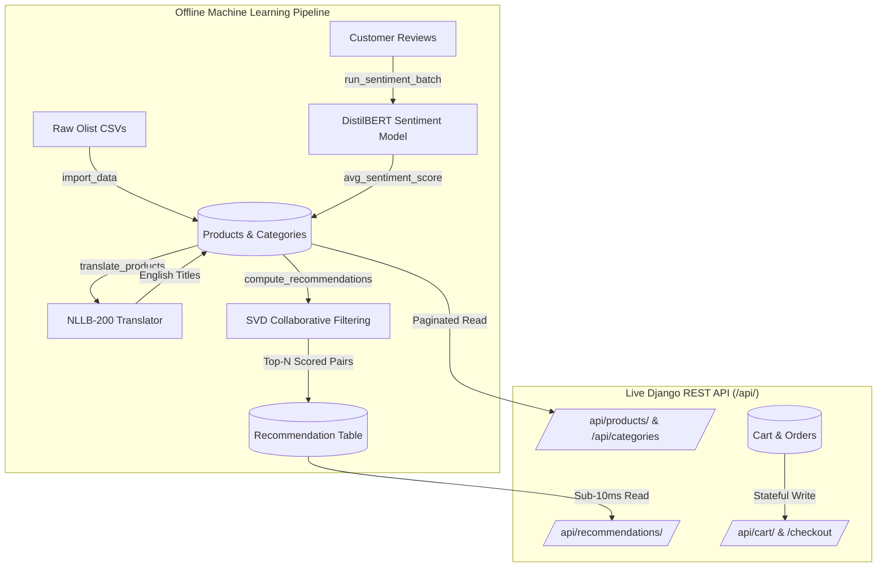

# Team Guide: E-Commerce Recommendation Backend & Architecture

> **Audience:** Development Team, Frontend Engineers, Data Science / ML Collaborators  
> **Stack:** Python 3.13, Django 6.1, Django REST Framework, scikit-surprise (SVD), Hugging Face Transformers  
> **Status:** Production-Ready & Verified  

---

## 📌 1. Executive Summary & Core Design Philosophy

This backend powers an intelligent e-commerce store built on the Brazilian Olist dataset. It provides catalog browsing, customer carts, order checkouts, and **personalized Collaborative Filtering recommendations**.

### The Golden Rule: "Zero ML Inference in the Request Path"
In real-world e-commerce, user-facing APIs must respond in **under 20 milliseconds**.
Running heavy Transformer models or training Matrix Factorization algorithms during a live HTTP request causes timeouts and crashes servers.

**Our Architecture Solution:**
- **Offline Batch Processing**: Heavy AI/ML calculations (text translation, review sentiment analysis, and SVD recommendation scoring) run periodically via background management commands and persist their outputs in the database.
- **Online Low-Latency API**: When users view a product or open their recommendation shelf, the API performs **lightning-fast database reads (<10ms)**.

---

## 🏛️ 2. High-Level Architecture



---

## 🧠 3. How the Collaborative Filtering (CF) Recommendation Engine Works

Our recommendation system uses **Matrix Factorization via SVD (Singular Value Decomposition)** trained with `scikit-surprise` (saved at `models/svd_cf.pkl`).

### 1. The Math Formula
For any given customer $u$ and candidate product $i$, the predicted preference rating is:

$$\hat{r}_{u,i} = \mu + b_u + b_i + q_i^T \cdot p_u$$

- $\mu$: Global average review rating across the entire store (~4.14 stars).
- $b_u$: Customer bias (does this user tend to rate products strictly or generously?).
- $b_i$: Product bias (is this product universally acclaimed or poorly rated?).
- $p_u$: 50-dimensional latent preference vector for customer $u$.
- $q_i$: 50-dimensional latent feature vector for product $i$.

### 2. Hybrid Sentiment Boost
If a product has customer reviews, its DistilBERT sentiment score ($\text{avg\_sentiment\_score} \in [0.0, 1.0]$) provides an additional boost:

$$\text{Final Score} = \hat{r}_{u,i} \times \left(1 + 0.1 \times \text{avg\_sentiment\_score}\right)$$

### 3. Deduplication (Purchase Exclusion)
Before scoring, the algorithm fetches the customer's purchase history and **excludes everything they already bought**. Customers never see duplicate recommendations for items already owned.

### 4. Cold-Start Fallback
If a brand new customer visits who was not in the training set, SVD cannot compute a vector. The system catches this and **automatically falls back to the store's top-selling Popularity Baseline**.

---

## 🧪 4. The 3-Customer Live Verification Scenario

To test and verify the Collaborative Filtering engine end-to-end, we established a reproducible scenario with **3 distinct customer personas**:

```powershell
uv run python manage.py seed_test_scenario
```

---

### 👤 Customer 1: Alice Silva (Home Decor & Furniture Fan)
- **Customer ID**: `c37cc6c1a59d81460a3059744f7ada1c` | São Paulo, SP
- **Past Purchase History (4 Items Bought)**:
  1. *Smart Furniture Decor #A5341E* ($88.94)
  2. *Essential Furniture Decor #A237DE* ($38.67)
  3. *Pro Furniture Decor #C2ECE6* ($83.08)
  4. *Classic Furniture Decor #64D0FE* ($89.18)
- **Top Recommendations Generated by SVD**:
  1. **Pro Pet Shop #A4AA7C** ($101.88) — SVD Score: **4.545** *(pet_shop)*
  2. **Premium Toys #6F33A4** ($140.99) — SVD Score: **4.422** *(toys)*
  3. **Modern Pet Shop #10876F** ($47.23) — SVD Score: **4.351** *(pet_shop)*
  4. **Urban Sports Leisure #94EDEF** ($194.68) — SVD Score: **4.349** *(sports_leisure)*
- **Live Endpoint**:  
  `GET http://127.0.0.1:8000/api/recommendations/c37cc6c1a59d81460a3059744f7ada1c/?n=5`

---

### 👤 Customer 2: Bruno Santos (Sports & Outdoor Enthusiast)
- **Customer ID**: `3e2157f91502458bc58455fd798ed58a` | Rio de Janeiro, RJ
- **Past Purchase History (4 Items Bought)**:
  1. *Urban Sports Leisure #583F15* ($45.33)
  2. *Signature Sports Leisure #81288D* ($110.54)
  3. *Deluxe Sports Leisure #219666* ($65.17)
  4. *Smart Sports Leisure #4B5E26* ($213.89)
- **Top Recommendations Generated by SVD**:
  1. **Pro Pet Shop #A4AA7C** ($101.88) — SVD Score: **4.661** *(pet_shop)*
  2. **Essential Furniture Decor #A237DE** ($38.67) — SVD Score: **4.596** *(furniture_decor)*
  3. **Smart Sports Leisure #B9EE75** ($69.90) — SVD Score: **4.492** *(sports_leisure)*
  4. **Signature Furniture Decor #A9E189** ($49.50) — SVD Score: **4.472** *(furniture_decor)*
- **Live Endpoint**:  
  `GET http://127.0.0.1:8000/api/recommendations/3e2157f91502458bc58455fd798ed58a/?n=5`

---

### 👤 Customer 3: Carlos Costa (Computers & Technology Geek)
- **Customer ID**: `feb2a9889d236875c3510880bf9576f3` | Curitiba, PR
- **Past Purchase History (4 Items Bought)**:
  1. *Premium Computers Accessories #FB6782* ($79.99)
  2. *Signature Computers Accessories #C7E027* ($112.82)
  3. *Essential Computers Accessories #7AA1AB* ($235.12)
  4. *Essential Computers Accessories #0CF3AB* ($88.50)
- **Top Recommendations Generated by SVD**:
  1. **Essential Furniture Decor #A237DE** ($38.67) — SVD Score: **4.725** *(furniture_decor)*
  2. **Pro Pet Shop #A4AA7C** ($101.88) — SVD Score: **4.663** *(pet_shop)*
  3. **Signature Furniture Decor #A9E189** ($49.50) — SVD Score: **4.445** *(furniture_decor)*
  4. **Smart Sports Leisure #B9EE75** ($69.90) — SVD Score: **4.432** *(sports_leisure)*
- **Live Endpoint**:  
  `GET http://127.0.0.1:8000/api/recommendations/feb2a9889d236875c3510880bf9576f3/?n=5`

---

### 📦 Live API Response Sample

```http
GET /api/recommendations/3e2157f91502458bc58455fd798ed58a/?n=2 HTTP/1.1
Host: 127.0.0.1:8000
```

```json
{
  "customer_external_id": "3e2157f91502458bc58455fd798ed58a",
  "count": 2,
  "results": [
    {
      "id": 1,
      "product": {
        "id": 497,
        "external_id": "a4aa7c1427c31344e5f7cc3d839fe562",
        "name": "Pet Shop Pro #A4AA7C",
        "name_translated": "Pro Pet Shop #A4AA7C",
        "category_id": 3,
        "category_name": "pet_shop",
        "price": "101.88",
        "avg_sentiment_score": 0.0,
        "total_purchases": 42,
        "image_url": "https://picsum.photos/seed/85b6b9c8/400/400"
      },
      "score": 4.661,
      "generated_at": "2026-09-30T10:41:22.970470Z"
    },
    {
      "id": 2,
      "product": {
        "id": 551,
        "external_id": "a237de12bdf0bfe4fe220bae65a89731",
        "name": "Moveis Decoracao Essencial #A237DE",
        "name_translated": "Essential Furniture Decor #A237DE",
        "category_id": 4,
        "category_name": "furniture_decor",
        "price": "38.67",
        "avg_sentiment_score": 0.0,
        "total_purchases": 37,
        "image_url": "https://picsum.photos/seed/c7eafc4a/400/400"
      },
      "score": 4.5957,
      "generated_at": "2026-09-30T10:41:22.970470Z"
    }
  ]
}
```

---

## 📡 5. Complete REST API Reference (For Frontend Integration)

Base URL: `http://127.0.0.1:8000/api/`

### 1. Catalog & Discovery

| Endpoint | Method | Params / Filters | Description |
|---|---|---|---|
| `/api/` | `GET` | — | Interactive root directory with hyperlinked API endpoints |
| `/api/categories/` | `GET` | `?search=`, `?ordering=` | List all 58 product categories with English names & product counts |
| `/api/categories/<id>/` | `GET` | — | Single category details |
| `/api/products/` | `GET` | `?category=`, `?search=`, `?ordering=`, `?page=` | Paginated product list (20 items/page). Sorting options: `-total_purchases`, `price`, `-price`, `-avg_sentiment_score` |
| `/api/products/<lookup>/` | `GET` | Accepts numeric ID `497` or Olist hash `a4aa7c...` | Full product detail card |

### 2. Shopping Cart & Checkout

| Endpoint | Method | Body Payload | Description |
|---|---|---|---|
| `/api/cart/<customer_id>/` | `GET` | — | View active cart, items list, and calculated total price |
| `/api/cart/<customer_id>/add/` | `POST` | `{"product_id": 497, "quantity": 1}` | Add product to cart or increment quantity |
| `/api/cart/<customer_id>/update/<item_id>/` | `PATCH` | `{"quantity": 3}` | Modify quantity of item in cart |
| `/api/cart/<customer_id>/remove/<item_id>/` | `DELETE` | — | Remove item from cart |
| `/api/cart/<customer_id>/checkout/` | `POST` | — | Convert cart into an `Order`, increments `total_purchases`, empties cart |

### 3. Recommendations

| Endpoint | Method | Query Params | Description |
|---|---|---|---|
| `/api/recommendations/<customer_id>/` | `GET` | `?n=5` (default: 10, max: 100) | Returns Top-N personalized products ranked by SVD score |

---

## 🚀 6. Quickstart: How to Run the Backend Locally

```powershell
# 1. Install dependencies via uv
uv sync

# 2. Apply database migrations
uv run python manage.py migrate

# 3. Import products and categories (if running on a clean database)
uv run python manage.py import_data --limit 1000

# 4. Run the 3-Customer SVD Verification Scenario
uv run python manage.py seed_test_scenario

# 5. Start the API development server
uv run python manage.py runserver
# Server runs on: http://127.0.0.1:8000/api/
```

---

## 📁 7. Codebase Layout & Key Files

```
recsys_backend/              # Main Django project configuration
├── settings.py              # Database, DRF, and ML model path settings
└── urls.py                  # Root routing (/admin/, /api/)

store/                       # Main application
├── models.py                # 9 Data models (Category, Customer, Product, Order, Recommendation, etc.)
├── serializers.py           # DRF serializers (includes deterministic display names & fallback titles)
├── views.py                 # DRF API views (Catalog, Cart, Checkout, and RecommendationListView)
├── urls.py                  # App URL routes
├── ml/
│   └── loader.py            # Singleton lazy loaders for SVD CF model & NLP DistilBERT model
└── management/commands/
    ├── import_data.py            # Step 1: Ingests Olist CSV dataset
    ├── translate_products.py     # Step 2: NLLB-200 translation command
    ├── run_sentiment_batch.py    # Step 3: DistilBERT sentiment scoring
    ├── compute_recommendations.py# Step 4: SVD Collaborative Filtering recommendation calculation
    └── seed_test_scenario.py     # Reproducible test runner for 3 customer personas
```
