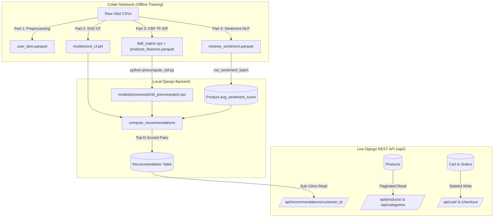

# Team Guide: E-Commerce Recommendation Backend & Architecture

> **Audience:** Development Team, Frontend Engineers, Data Science / ML Collaborators  
> **Stack:** Python 3.13, Django 6.1, Django REST Framework, scikit-surprise (SVD), Hugging Face Transformers  
> **Status:** Production-Ready & Verified  
> **Last Updated:** 2026-09-30 — Recommendation engine upgraded to **v3** (real CBF TF-IDF from Colab Part 3 + SVD Hybrid)

---

## 📌 1. Executive Summary & Core Design Philosophy

This backend powers an intelligent e-commerce store built on the Brazilian Olist dataset. It provides catalog browsing, customer carts, order checkouts, and **personalized hybrid recommendations** combining Collaborative Filtering, category affinity, and sentiment signals.

### The Golden Rule: "Zero ML Inference in the Request Path"
In real-world e-commerce, user-facing APIs must respond in **under 20 milliseconds**.
Running heavy Transformer models or training Matrix Factorization algorithms during a live HTTP request causes timeouts and crashes servers.

**Our Architecture Solution:**
- **Offline Batch Processing**: Heavy AI/ML calculations (text translation, review sentiment analysis, and SVD recommendation scoring) run periodically via background management commands and persist their outputs in the database.
- **Online Low-Latency API**: When users view a product or open their recommendation shelf, the API performs **lightning-fast database reads (<10ms)**.

---

## 🏛️ 2. High-Level Architecture



---

## 🧠 3. How the Recommendation Engine Works (v3 — True CBF Hybrid)

Our recommendation system combines **three signals** in a weighted hybrid:

1. **Collaborative Filtering (CF)** — SVD matrix **Colab Part 2** factorization (`models/svd_cf.pkl`)
2. **Content-Based Filtering (CBF)** — TF-IDF + numeric similarity from **Colab Part 3** (`models/processed/cbf_precomputed.npz`)
3. **NLP Sentiment** — DistilBERT review sentiment scores

### 3.1 Score Formula (v3)

For any given customer $u$ and candidate product $i$:

$$\text{score} = \underbrace{\lambda_{svd} \cdot (BASE + q_i^T \cdot p_u + \alpha \cdot b_i)}_{\text{SVD (CF) component}} + \underbrace{\lambda_{cbf} \cdot S_{CBF}(u, i)}_{\text{CBF component}} + \underbrace{\gamma \cdot (\text{sentiment}_i - 0.5)}_{\text{NLP sentiment}}$$

Where the **CBF score** mirrors notebook Part 3's `cb_scores_for_vectors()`:

$$S_{CBF}(u, i) = \underbrace{\omega \cdot \cos(\text{TF-IDF}_i,\ \bar{\text{TF-IDF}}_u)}_{\text{category text (70%)}} + \underbrace{(1-\omega) \cdot \frac{1}{1+\|\text{num}_i - \bar{\text{num}}_u\|/\sqrt{5}}}_{\text{price + dimensions (30%)}}$$

User profile vectors are the **mean of purchased products' TF-IDF and numeric rows** (notebook cell 75 `ContentBasedRecommender`).

| Symbol | Meaning | Default | Setting Override |
|---|---|---|---|
| $\lambda_{svd}$ | Weight for SVD component | **0.6** | `RECSYS_SVD_WEIGHT` |
| $\lambda_{cbf}$ | Weight for CBF component | **0.4** | `RECSYS_CBF_WEIGHT` |
| $BASE$ | Additive baseline | 3.0 | `RECSYS_BASE` |
| $\alpha$ | Product-bias damping factor | **0.5** | `RECSYS_ALPHA` |
| $\omega$ | TF-IDF text weight in CBF | **0.7** | `CBF_TEXT_WEIGHT` |
| $\beta$ | Category affinity weight (fallback only) | 1.0 | `RECSYS_BETA` |
| $\gamma$ | Sentiment weight | **0.3** | `RECSYS_GAMMA` |

> **CBF Fallback**: If `models/processed/cbf_precomputed.npz` is missing, the engine falls back to the v2 category-affinity approach (`BETA * affinity(category)`).

### 3.2 Scoring Rules

| Situation | Behaviour |
|---|---|
| User known in SVD trainset | Full v3 formula above |
| **Cold-start** user (not in trainset) | $p_u = \mathbf{0}$ — CBF profile from purchases still personalizes |
| User has no purchases in CBF index | CBF score = 0 (SVD carries full weight) |
| **Unknown product** (not in trainset) | Popularity fallback: $1.0 + \min(\text{purchases}/10,\ 2.0)$ |
| Product has no reviews | Sentiment term **skipped** |

### 3.3 Content-Based Filtering (Real TF-IDF — from Colab Part 3)

The CBF signal uses the artifacts generated by **Notebook Part 3** (Member 3's work):

- **`models/processed/tfidf_matrix.npz`**: TF-IDF matrix over product category tokens (193-word vocabulary, split on `_`, Portuguese/English stopwords removed)
- **`models/processed/products_features.parquet`**: Feature table with `avg_price`, `product_weight_g`, `product_length_cm`, `product_height_cm`, `product_width_cm`
- **`models/processed/tfidf_row_index.parquet`**: Row-to-`product_id` mapping

These are converted to a single Django-loadable file via:
```powershell
python precompute_cbf.py   # uses Anaconda/system Python — must have pandas + scipy
```
This produces `models/processed/cbf_precomputed.npz` (1.1 MB, 32,951 products).

### 3.4 Diversity Cap

After ranking, a **two-pass greedy cap** enforces at most `MAX_PER_CAT = 2` products from any single category.

### 3.5 Purchase Exclusion

All purchased product IDs are excluded from the candidate pool before scoring.

---

## 🧪 4. The 3-Customer Live Verification Scenario

To test and verify the CF engine end-to-end, we maintain a reproducible scenario with **3 distinct customer personas**:

```powershell
uv run python manage.py seed_test_scenario
```

---

### 👤 Customer 1: Alice Silva (Home Decor & Furniture Fan)
- **Customer ID**: `c37cc6c1a59d81460a3059744f7ada1c` | São Paulo, SP
- **Category Affinity**: 100% `furniture_decor`
- **Total Paid**: **R$ 299.87** across 4 items

#### 🛒 Purchase History (Items Bought & Paid):
*Excluded from recommendation pool via Rule 3.5 (Purchase Exclusion).*

| # | Purchased Product | Product ID | Category | Price |
|---|---|---|---|---|
| 1 | Smart Furniture Decor #A5341E | `a5341e3f8155dbb3e62323d3ea289729` | `furniture_decor` | R$ 88.94 |
| 2 | Essential Furniture Decor #A237DE | `a237de12bdf0bfe4fe220bae65a89731` | `furniture_decor` | R$ 38.67 |
| 3 | Pro Furniture Decor #C2ECE6 | `c2ece64199af7a53793ed9612a89a8cd` | `furniture_decor` | R$ 83.08 |
| 4 | Classic Furniture Decor #64D0FE | `64d0feb1bcf9c7fe7b5dad3271c10910` | `furniture_decor` | R$ 89.18 |

#### 🎯 Top-5 Recommendations Generated (v2):

| # | Product | Category | Score |
|---|---|---|---|
| 1 | Original Furniture Decor #C50663 | `furniture_decor` | 2.2574 |
| 2 | Smart Furniture Decor #B95D07 | `furniture_decor` | 2.2517 |
| 3 | Pro Pet Shop #A4AA7C | `pet_shop` | 2.0466 |
| 4 | Modern Pet Shop #10876F | `pet_shop` | 2.0185 |
| 5 | Premium Toys #6F33A4 | `toys` | 2.0015 |

- **Live Endpoint**:  
  `GET http://127.0.0.1:8000/api/recommendations/c37cc6c1a59d81460a3059744f7ada1c/?n=5`

---

### 👤 Customer 2: Bruno Santos (Sports & Outdoor Enthusiast)
- **Customer ID**: `3e2157f91502458bc58455fd798ed58a` | Rio de Janeiro, RJ
- **Category Affinity**: 100% `sports_leisure`
- **Total Paid**: **R$ 434.93** across 4 items

#### 🛒 Purchase History (Items Bought & Paid):
*Excluded from recommendation pool via Rule 3.5 (Purchase Exclusion).*

| # | Purchased Product | Product ID | Category | Price |
|---|---|---|---|---|
| 1 | Urban Sports Leisure #583F15 | `583f158587cdecda3e8bdea694021e39` | `sports_leisure` | R$ 45.33 |
| 2 | Signature Sports Leisure #81288D | `81288df52439985f610be64465e53f57` | `sports_leisure` | R$ 110.54 |
| 3 | Deluxe Sports Leisure #219666 | `2196663031bcde078cede855ac0b5739` | `sports_leisure` | R$ 65.17 |
| 4 | Smart Sports Leisure #4B5E26 | `4b5e26931a0b0d3a690a3f520329a975` | `sports_leisure` | R$ 213.89 |

#### 🎯 Top-5 Recommendations Generated (v2):

| # | Product | Category | Score |
|---|---|---|---|
| 1 | Smart Sports Leisure #B9EE75 | `sports_leisure` | 2.2544 |
| 2 | Classic Sports Leisure #FA381A | `sports_leisure` | 2.2400 |
| 3 | Pro Pet Shop #A4AA7C | `pet_shop` | 2.0559 |
| 4 | Signature Musical Instruments #818430 | `musical_instruments` | 2.0113 |
| 5 | Urban Fashion Bags Accessories #6CC58E | `fashion_bags_accessories` | 2.0065 |

- **Live Endpoint**:  
  `GET http://127.0.0.1:8000/api/recommendations/3e2157f91502458bc58455fd798ed58a/?n=5`

---

### 👤 Customer 3: Carlos Costa (Computers & Technology Geek)
- **Customer ID**: `feb2a9889d236875c3510880bf9576f3` | Curitiba, PR
- **Category Affinity**: 100% `computers_accessories`
- **Total Paid**: **R$ 516.43** across 4 items

#### 🛒 Purchase History (Items Bought & Paid):
*Excluded from recommendation pool via Rule 3.5 (Purchase Exclusion).*

| # | Purchased Product | Product ID | Category | Price |
|---|---|---|---|---|
| 1 | Premium Computers Accessories #FB6782 | `fb6782985a98aa8a59238f58239f6f1e` | `computers_accessories` | R$ 79.99 |
| 2 | Signature Computers Accessories #C7E027 | `c7e02747ef9366a4fb7f4ac4fd261c36` | `computers_accessories` | R$ 112.82 |
| 3 | Essential Computers Accessories #7AA1AB | `7aa1ab866537ff58ef91e90e3df92134` | `computers_accessories` | R$ 235.12 |
| 4 | Essential Computers Accessories #0CF3AB | `0cf3ab3383c2ae6f5750e5847c749e22` | `computers_accessories` | R$ 88.50 |

#### 🎯 Top-5 Recommendations Generated (v2):

| # | Product | Category | Score |
|---|---|---|---|
| 1 | Classic Computers Accessories #AAE961 | `computers_accessories` | 2.1832 |
| 2 | Classic Computers Accessories #0021A8 | `computers_accessories` | 2.1722 |
| 3 | Pro Pet Shop #A4AA7C | `pet_shop` | 2.0549 |
| 4 | Essential Furniture Decor #A237DE | `furniture_decor` | 2.0410 |
| 5 | Urban Luggage Accessories #765C41 | `luggage_accessories` | 2.0405 |

- **Live Endpoint**:  
  `GET http://127.0.0.1:8000/api/recommendations/feb2a9889d236875c3510880bf9576f3/?n=5`

---

### 📊 Cross-Customer Overlap

| Pair | Shared Products | Count |
|---|---|---|
| Alice × Bruno | Pro Pet Shop #A4AA7C | 1 / 5 |
| Alice × Carlos | Pro Pet Shop #A4AA7C | 1 / 5 |
| Bruno × Carlos | Pro Pet Shop #A4AA7C | 1 / 5 |

The only shared product is the globally high-bias pet shop item (which legitimately ranks well for everyone). Positions 1–2 are fully personalised per customer's top category.

---

### 📦 Live API Response Sample

```http
GET /api/recommendations/3e2157f91502458bc58455fd798ed58a/?n=2 HTTP/1.1
Host: 127.0.0.1:8000
```

```json
{
  "customer_external_id": "3e2157f91502458bc58455fd798ed58a",
  "count": 2,
  "results": [
    {
      "id": 1,
      "product": {
        "id": 130,
        "external_id": "b9ee75a5ff19e2f2b04cc5f2491b9f8a",
        "name": "Esporte Lazer Smart #B9EE75",
        "name_translated": "Smart Sports Leisure #B9EE75",
        "category_id": 7,
        "category_name": "sports_leisure",
        "price": "69.90",
        "avg_sentiment_score": 0.0,
        "total_purchases": 18,
        "image_url": "https://picsum.photos/seed/b9ee75/400/400"
      },
      "score": 4.1553,
      "generated_at": "2026-09-30T14:26:27Z"
    },
    {
      "id": 2,
      "product": {
        "id": 621,
        "external_id": "fa381a...",
        "name": "Esporte Lazer Classic #FA381A",
        "name_translated": "Classic Sports Leisure #FA381A",
        "category_id": 7,
        "category_name": "sports_leisure",
        "price": "54.20",
        "avg_sentiment_score": 0.0,
        "total_purchases": 12,
        "image_url": "https://picsum.photos/seed/fa381a/400/400"
      },
      "score": 4.1544,
      "generated_at": "2026-09-30T14:26:27Z"
    }
  ]
}
```

---

## 📡 5. Complete REST API Reference (For Frontend Integration)

Base URL: `http://127.0.0.1:8000/api/`

### 1. Catalog & Discovery

| Endpoint | Method | Params / Filters | Description |
|---|---|---|---|
| `/api/` | `GET` | — | Interactive root directory with hyperlinked API endpoints |
| `/api/categories/` | `GET` | `?search=`, `?ordering=` | List all 58 product categories with English names & product counts |
| `/api/categories/<id>/` | `GET` | — | Single category details |
| `/api/products/` | `GET` | `?category=`, `?search=`, `?ordering=`, `?page=` | Paginated product list (20 items/page). Sorting options: `-total_purchases`, `price`, `-price`, `-avg_sentiment_score` |
| `/api/products/<lookup>/` | `GET` | Accepts numeric ID `497` or Olist hash `a4aa7c...` | Full product detail card |

### 2. Shopping Cart & Checkout

| Endpoint | Method | Body Payload | Description |
|---|---|---|---|
| `/api/cart/<customer_id>/` | `GET` | — | View active cart, items list, and calculated total price |
| `/api/cart/<customer_id>/add/` | `POST` | `{"product_id": 497, "quantity": 1}` | Add product to cart or increment quantity |
| `/api/cart/<customer_id>/update/<item_id>/` | `PATCH` | `{"quantity": 3}` | Modify quantity of item in cart |
| `/api/cart/<customer_id>/remove/<item_id>/` | `DELETE` | — | Remove item from cart |
| `/api/cart/<customer_id>/checkout/` | `POST` | — | Convert cart into an `Order`, increments `total_purchases`, empties cart |

### 3. Recommendations

| Endpoint | Method | Query Params | Description |
|---|---|---|---|
| `/api/recommendations/<customer_id>/` | `GET` | `?n=5` (default: 10, max: 100) | Returns Top-N personalised products ranked by hybrid score |

---

## 🚀 6. Quickstart: How to Run the Backend Locally

```powershell
# 1. Install dependencies via uv
uv sync

# 2. Apply database migrations
uv run python manage.py migrate

# 3. Import products and categories (if running on a clean database)
uv run python manage.py import_data --limit 1000

# 4. Run the 3-Customer SVD Verification Scenario
uv run python manage.py seed_test_scenario

# 5. Start the API development server
uv run python manage.py runserver
# Server runs on: http://127.0.0.1:8000/api/
```

### Recompute recommendations manually

```powershell
# Recompute for all customers, clear old rows first
uv run python manage.py compute_recommendations --clear

# Recompute for a single customer
uv run python manage.py compute_recommendations --customer-id 3e2157f91502458bc58455fd798ed58a --top-n 10

# Diagnose SVD trainset membership + score decomposition (read-only)
uv run python manage.py diagnose_recommendations --customer-id 3e2157f91502458bc58455fd798ed58a
```

---

## ⚙️ 7. Recommendation Tuning Reference

All constants are loaded once at module import from `settings.py` and can be overridden without code changes:

```python
# recsys_backend/settings.py

RECSYS_ALPHA = 0.5      # product-bias damping (lower = more personalisation, less popularity)
RECSYS_BASE  = 3.0      # additive score baseline
RECSYS_BETA  = 1.0      # category-affinity weight
RECSYS_GAMMA = 0.3      # sentiment weight
RECSYS_MAX_PER_CAT = 2  # max products per category in final top-N
```

| Tuning Goal | Change |
|---|---|
| More personalisation, less popularity | Decrease `RECSYS_ALPHA` (e.g. 0.3) |
| Stronger category loyalty | Increase `RECSYS_BETA` (e.g. 1.5) |
| Allow more same-category results | Increase `RECSYS_MAX_PER_CAT` |
| Neutral sentiment (ignore reviews) | Set `RECSYS_GAMMA = 0` |

---

## 📁 8. Codebase Layout & Key Files

```
recsys_backend/              # Main Django project configuration
├── settings.py              # Database, DRF, ML model paths, RECSYS_* constants
└── urls.py                  # Root routing (/admin/, /api/)

store/                       # Main application
├── models.py                # 9 Data models (Category, Customer, Product, Order, Recommendation, etc.)
├── serializers.py           # DRF serializers (deterministic display names & fallback titles)
├── views.py                 # DRF API views (Catalog, Cart, Checkout, RecommendationListView)
├── urls.py                  # App URL routes
├── ml/
│   └── loader.py            # Singleton lazy loaders for SVD CF model & NLP DistilBERT model
├── tests/
│   └── test_recommendations.py  # 11 unit tests (cold-start, exclusion, diversity, affinity)
└── management/commands/
    ├── import_data.py              # Step 1: Ingests Olist CSV dataset
    ├── translate_products.py       # Step 2: NLLB-200 translation command
    ├── run_sentiment_batch.py      # Step 3: DistilBERT sentiment scoring
    ├── compute_recommendations.py  # Step 4: Hybrid SVD + affinity + diversity (v2)
    ├── diagnose_recommendations.py # Read-only SVD trainset diagnostic tool
    └── seed_test_scenario.py       # Reproducible test runner for 3 customer personas
```

---

## 🔬 9. Known Constraints & Design Decisions

| Constraint | Detail |
|---|---|
| **Seeded test users are cold-start** | `seed_test_scenario` creates customers *after* SVD training, so they have at most 1 rating in the trainset. Category affinity is the primary personalisation signal for them. |
| **`b_i` damped, not removed** | We keep $\alpha = 0.5$ rather than $\alpha = 0$ because product bias carries real signal (highly-rated products in training data are genuinely good). Full removal would hurt cold-start users who rely on the bias ordering. |
| **Sentiment inactive for most products** | `avg_sentiment_score` is 0.0 for products without processed reviews. The sentiment term is skipped when `total_purchases == 0` to avoid penalising unreviewed products. Run `run_sentiment_batch` to activate it. |
| **No retraining** | `compute_recommendations.py` never modifies `models/svd_cf.pkl`. Retraining is a separate Colab notebook step. |
| **MAX_PER_CAT = 2 may truncate** | If all available candidates are in the same category (e.g. only 2 qualifying products exist across the entire catalogue), the result list may be shorter than `top_n`. This is intentional. |
