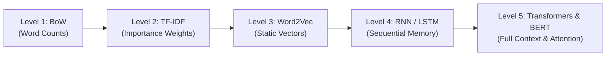

# 📘 From Scratch to Fine-Tuning: The Ultimate NLP Guide
### *Understanding BoW, TF-IDF, Word Embeddings, Transformers, and How We Fine-Tuned DistilBERT*

---

## 📌 Table of Contents
1. [The Big Picture: Are We Using BoW or TF-IDF?](#1-the-big-picture-are-we-using-bow-or-tf-idf)
2. [The Evolution of NLP (From Counting Words to Deep Context)](#2-the-evolution-of-nlp)
   - [Level 1: Bag of Words (BoW)](#level-1-bag-of-words-bow)
   - [Level 2: TF-IDF (Term Frequency – Inverse Document Frequency)](#level-2-tf-idf-term-frequency--inverse-document-frequency)
   - [Level 3: Static Word Embeddings (Word2Vec, GloVe)](#level-3-static-word-embeddings-word2vec-glove)
   - [Level 4: Sequential Neural Networks (RNNs, LSTMs)](#level-4-sequential-neural-networks-rnns-lstms)
   - [Level 5: Transformers & Attention (The Modern Era)](#level-5-transformers--attention-the-modern-era)
3. [Pre-training vs. Fine-tuning Explained](#3-pre-training-vs-fine-tuning-explained)
4. [What is DistilBERT & Why Did We Choose It?](#4-what-is-distilbert--why-did-we-choose-it)
5. [Deep Dive: How Fine-Tuning Works Step-by-Step in Our Code](#5-deep-dive-how-fine-tuning-works-step-by-step-in-our-code)
   - [Step A: Subword Tokenization (WordPiece)](#step-a-subword-tokenization-wordpiece)
   - [Step B: Input Representations ([CLS], [SEP], Attention Masks)](#step-b-input-representations-cls-sep-attention-masks)
   - [Step C: Self-Attention & Transformer Layers](#step-c-self-attention--transformer-layers)
   - [Step D: The Classification Head (Transfer Learning)](#step-d-the-classification-head-transfer-learning)
   - [Step E: Loss Function & Class Weighting](#step-e-loss-function--class-weighting)
   - [Step F: Backpropagation & Optimizer (AdamW + Linear Warmup)](#step-f-backpropagation--optimizer-adamw--linear-warmup)
   - [Step G: Mixed Precision (FP16 AMP) on GTX 1650 Ti](#step-g-mixed-precision-fp16-amp-on-gtx-1650-ti)
6. [Summary Comparison Table (BoW vs. TF-IDF vs. Transformers)](#6-summary-comparison-table)
7. [Glossary of Key Terms](#7-glossary-of-key-terms)

---

## 1. The Big Picture: Are We Using BoW or TF-IDF?

> **Short Answer: No, we are NOT using BoW or TF-IDF in our final model.**

Instead of building a model from zero using simple statistical word counts (like BoW or TF-IDF), we used **Transfer Learning (Fine-Tuning DistilBERT)**.

### Why Didn't We Use BoW or TF-IDF?
Let's see an example review:
1. *"The phone is not good, it is very bad."*
2. *"The phone is not bad, it is very good."*

- **BoW & TF-IDF** count how many times words like `phone`, `not`, `good`, and `bad` appear. Both sentences contain the **exact same words**! BoW will represent both sentences almost identically, even though they mean opposite things!
- **DistilBERT** uses **Self-Attention** to understand word order and context. It knows that `not` attaches to `good` in sentence 1, but `not` attaches to `bad` in sentence 2.

---

## 2. The Evolution of NLP

To truly appreciate what fine-tuning does, let's trace how NLP evolved over time.



---

### Level 1: Bag of Words (BoW)
**Concept:** Treat text as an unordered "bag" of words and count their frequency.

#### Example:
- Review 1: `"Fast delivery, great product"`
- Review 2: `"Slow delivery, terrible product"`

**Vocabulary:** `["fast", "delivery", "great", "product", "slow", "terrible"]`

Vectors:
- Review 1: `[1, 1, 1, 1, 0, 0]`
- Review 2: `[0, 1, 0, 1, 1, 1]`

#### Limitations:
1. **Loses Word Order:** `"not great, actually terrible"` vs. `"not terrible, actually great"`.
2. **Extreme Sparsity:** If your vocabulary has 50,000 words, each review vector is 50,000 numbers long with 99.9% zeros.
3. **No Semantic Meaning:** `fast` and `quick` are treated as completely unrelated dimensions.

---

### Level 2: TF-IDF (Term Frequency – Inverse Document Frequency)
**Concept:** A smarter mathematical weighting on top of BoW. Instead of pure counts, give higher weight to rare, informative words, and lower weight to common words like `"the"`, `"is"`, `"product"`.

$$\text{TF-IDF}(t, d, D) = \text{TF}(t, d) \times \text{IDF}(t, D)$$

Where:
- $\text{TF}(t, d)$: How many times term $t$ appears in review $d$.
- $\text{IDF}(t, D) = \log\left(\frac{N}{1 + \text{count of reviews containing } t}\right)$: How rare term $t$ is across the entire dataset.

#### Why was TF-IDF popular?
- If the word `"defective"` appears in only 10 reviews out of 10,000, its IDF is very high! If a review has `"defective"`, the model knows it strongly signals a negative review.
- The word `"package"` appears in 8,000 reviews, so its IDF is near zero.

#### Why is TF-IDF still limited?
- Still suffers from **no word order**, **no context**, and **no semantic similarity** (`broken` vs `damaged` are still distinct independent features).

---

### Level 3: Static Word Embeddings (Word2Vec, GloVe)
**Concept:** Instead of a single number count, represent each word as a dense vector of real numbers (e.g., 300 dimensions) learned from reading billions of sentences.

- Words with similar meanings have vectors close together in geometric space:
  $$\text{Vector}(\text{"good"}) \approx \text{Vector}(\text{"great"}) \approx \text{Vector}(\text{"excellent"})$$
- Famous vector arithmetic:
  $$\text{Vector}(\text{"King"}) - \text{Vector}(\text{"Man"}) + \text{Vector}(\text{"Woman"}) \approx \text{Vector}(\text{"Queen"})$$

#### Fatal Flaw: Polysemy (No Context)
In Word2Vec, the word `"bank"` has **one single vector**, whether you say:
- *"I deposited money in the bank"* (financial institution)
- *"I sat on the river bank"* (edge of water)

---

### Level 4: Sequential Neural Networks (RNNs, LSTMs)
**Concept:** Read sentences word by word, updating a hidden memory state $h_t$ at each step.

- **Pros:** Finally captures word order!
- **Cons:**
  1. **Vanishing Gradients:** Forget early words in long reviews.
  2. **Sequential Bottleneck:** Must process word 1, then word 2, then word 3. **Cannot train in parallel on modern GPUs!**

---

### Level 5: Transformers & Attention (The Modern Era)
In 2017, Google published *"Attention Is All You Need"*, introducing the **Transformer**.

Instead of reading one word at a time, Transformers process **all words in parallel** using **Self-Attention**:
- Every word looks at every other word in the sentence simultaneously.
- When reading `"bank"`, the model looks at `"river"` or `"money"` elsewhere in the sentence to compute a **contextual embedding** on the fly!

---

## 3. Pre-training vs. Fine-tuning Explained

Building a state-of-the-art NLP model from scratch requires:
- Tens of millions of dollars
- Hundreds of GPUs running for weeks
- Terabytes of text (Wikipedia, books, news, web pages)

This is where **Transfer Learning** comes in:

```
[ PHASE 1: PRE-TRAINING (Done by Hugging Face / Google) ]
Massive unlabeled text (Wikipedia + Books: 3.3 Billion words)
                      ↓
Pre-trained BERT / DistilBERT
(Understands English grammar, synonyms, sentence structures, tone)
                      ↓
[ PHASE 2: FINE-TUNING (What WE Did in train_model.py) ]
Our 37,393 translated Olist reviews + Sentiment labels
                      ↓
Trained on your GTX 1650 Ti for ~20 minutes
                      ↓
Specialized E-Commerce Sentiment Classifier!
```

---

## 4. What is DistilBERT & Why Did We Choose It?

**BERT** (Bidirectional Encoder Representations from Transformers) is powerful, but heavy:
- BERT-base: 110 Million parameters (requires high VRAM, slower inference).

**DistilBERT** was created using a technique called **Knowledge Distillation**:
- A small student model (DistilBERT) is trained to mimic a large teacher model (BERT).
- **40% smaller** (66 Million parameters vs 110M)
- **60% faster** during training and inference
- **Retains 97%** of BERT’s full language understanding!

This made it the **ideal architecture** for your local **NVIDIA GTX 1650 Ti (4GB VRAM)**.

---

## 5. Deep Dive: How Fine-Tuning Works Step-by-Step in Our Code

Here is the exact journey of a customer review through our pipeline in [`train_model.py`](file:///d:/01_Projects_Workspace/Recoomedation%20System%20Copstoe%20Project/train_model.py):

---

### Step A: Subword Tokenization (WordPiece)

Computers cannot read characters or words directly; they read integer IDs.
DistilBERT uses **WordPiece Tokenization**:
- Common words remain whole words: `"great"` $\rightarrow$ `[2307]`
- Rare or compound words are broken into subwords: `"unboxing"` $\rightarrow$ `["un", "##box", "##ing"]`
- This ensures **zero Out-Of-Vocabulary (OOV) errors**!

In Python:
```python
tokenizer = AutoTokenizer.from_pretrained("distilbert-base-uncased")
tokens = tokenizer("The phone arrived broken!")
# Output input_ids: [101, 1996, 3042, 2698, 3600, 999, 102]
```

---

### Step B: Input Representations ([CLS], [SEP], Attention Masks)

Every input given to DistilBERT is formatted with special tokens:
1. `[CLS]` (Classification Token, ID `101`): Always placed at the very beginning. Its final output vector will represent the **summary of the entire sentence**.
2. `[SEP]` (Separator Token, ID `102`): Marks the end of the text.
3. `[PAD]` (Padding Token, ID `0`): Fills short sentences to match the batch length.
4. `Attention Mask`: A list of `1`s (real words) and `0`s (padding) so the model ignores pad tokens.

```
Sentence: "Great phone"
Input IDs:       [ 101,   2307,   3042,   102,     0,     0  ]
Tokens:         [[CLS], "great", "phone", [SEP], [PAD], [PAD]]
Attention Mask:  [  1,      1,      1,      1,     0,     0  ]
```

In our code, we used `DataCollatorWithPadding(tokenizer=tokenizer)`. Instead of padding everything to 256 tokens, it dynamically pads each batch only to its longest sentence. This saved massive GPU memory and speed!

---

### Step C: Self-Attention & Transformer Layers

DistilBERT passes the token embeddings through **6 Transformer Encoder layers**.

In each layer, the **Self-Attention** mechanism computes three vectors for each token:
- **Query ($Q$):** What this word is asking for.
- **Key ($K$):** What this word has to offer.
- **Value ($V$):** The actual informational content of the word.

$$\text{Attention}(Q, K, V) = \text{softmax}\left(\frac{Q K^T}{\sqrt{d_k}}\right) V$$

This allows the model to compute attention scores:
- In *"I ordered black but got pink, very disappointed"*, the token `disappointed` pays high attention to `pink` and `got`.
- The representations become rich with context.

---

### Step D: The Classification Head (Transfer Learning)

Pretrained DistilBERT outputs a 768-dimensional vector for each token.
To turn this into a sentiment classifier, we attach a **Classification Head**:

```
[Review Text]
      ↓
[DistilBERT 6 Transformer Layers]
      ↓
Hidden states for all tokens: (Batch, Sequence_Length, 768)
      ↓
Extract the first token representation: [CLS] vector (768 dimensions)
      ↓
[Dropout (p=0.2)]  ← Prevents overfitting
      ↓
[Linear Layer: 768 -> 2]  (in Binary Mode: Negative vs. Positive)
      ↓
Logits: [logit_Negative, logit_Positive]
      ↓
[Softmax]
      ↓
Probabilities: [0.03, 0.97]  → 97% Positive!
```

---

### Step E: Loss Function & Class Weighting

In our dataset:
- Negative reviews (Class 0): ~29.1%
- Positive reviews (Class 1): ~70.9%

If a model simply guesses "Positive" every time, it would get 70.9% accuracy without learning anything!
To fix this, we used **Inverse-Frequency Weighted Cross-Entropy Loss**:

```python
# Compute weights inversely proportional to class frequency
weights = [total / (2 * count_neg), total / (2 * count_pos)]
# Negative weight ≈ 1.72 | Positive weight ≈ 0.70
loss_fn = nn.CrossEntropyLoss(weight=torch.tensor([1.72, 0.70]).to(device))
```
- If the model misclassifies a **Negative** review, it is penalized **2.5× harder** than misclassifying a Positive review!
- This forced DistilBERT to learn the nuances of complaints and negative sentiment.

---

### Step F: Backpropagation & Optimizer (AdamW + Linear Warmup)

During training:
1. **Forward Pass:** The review goes through DistilBERT $\rightarrow$ Logits $\rightarrow$ Loss is calculated.
2. **Backward Pass:** PyTorch calculates the gradients ($\frac{\partial \text{Loss}}{\partial W}$) for all weights across the model.
3. **AdamW Optimizer:** Updates the weights. We applied weight decay (0.01) to regularize the model, but exempted bias and LayerNorm parameters.
4. **Learning Rate Scheduler:**
   - **Warmup:** Increases learning rate from $0$ up to $2 \times 10^{-5}$ over the first 10% of training steps.
   - **Linear Decay:** Gradually drops the learning rate towards $0$ over the remaining 90% of training steps.

---

### Step G: Mixed Precision (FP16 AMP) on GTX 1650 Ti

Standard neural networks use **FP32** (32-bit floating point numbers).
In `train_model.py`, we enabled **Automatic Mixed Precision (AMP)**:
```python
with torch.amp.autocast("cuda", enabled=True):
    outputs = model(input_ids, attention_mask)
    loss = loss_fn(outputs.logits, labels)
```
- Multiplications are computed in **FP16** (half precision, 16 bits).
- Uses **50% less GPU VRAM**.
- Runs roughly **2× faster** on Turing-architecture GPUs (like the GTX 1650 Ti).

---

## 6. Summary Comparison Table

| Approach | Feature Extraction | Understands Word Order? | Understands Negation ("not good")? | Training Data Needed | Handling Out-of-Vocabulary (OOV) |
|---|---|---|---|---|---|
| **Bag of Words (BoW)** | Word count frequency | ❌ No | ❌ No | Needs thousands of labeled reviews | ❌ Fails on unseen words |
| **TF-IDF** | Term frequency $\times$ inverse document frequency | ❌ No | ❌ No | Needs thousands of labeled reviews | ❌ Fails on unseen words |
| **Word2Vec / GloVe** | Static dense vectors (e.g. 300D) | ❌ No (unless fed to RNN) | ❌ Poor | Millions of words | ❌ Fails on unseen words |
| **LSTM / GRU** | Sequential memory state | ✅ Yes | ⚠️ Partially (struggles with long sentences) | Requires large training sets | ⚠️ Dependent on tokenizer |
| **DistilBERT (Fine-Tuning)** *(Our Approach)* | Bidirectional Self-Attention + Transfer Learning | ✅ Yes | ✅ Yes (full context) | Small-to-medium dataset (already knows English!) | ✅ Subwords (WordPiece) handle any word |

---

## 7. Glossary of Key Terms

- **Fine-Tuning:** Taking a model already trained on massive generic text and training it further on your specific domain dataset (Olist reviews).
- **Logits:** Raw, unnormalized prediction scores output by the final linear layer of the neural network before converting into probabilities.
- **Softmax:** A mathematical function that converts arbitrary logits into a valid probability distribution (summing to 1.0 or 100%).
- **Macro F1:** The unweighted average of F1 scores across all classes. It treats the minority class (Negative) with equal importance as the majority class (Positive).
- **Overfitting:** When a model memorizes the training data instead of learning general patterns, causing validation performance to drop. Prevented via Dropout and Weight Decay.
- **AMP (Automatic Mixed Precision):** Executing training operations in 16-bit floats while maintaining master weights in 32-bit floats to accelerate training and reduce VRAM usage.

---
*Created as part of the E-Commerce Sentiment Analysis & Recommendation System Capstone Project.*
